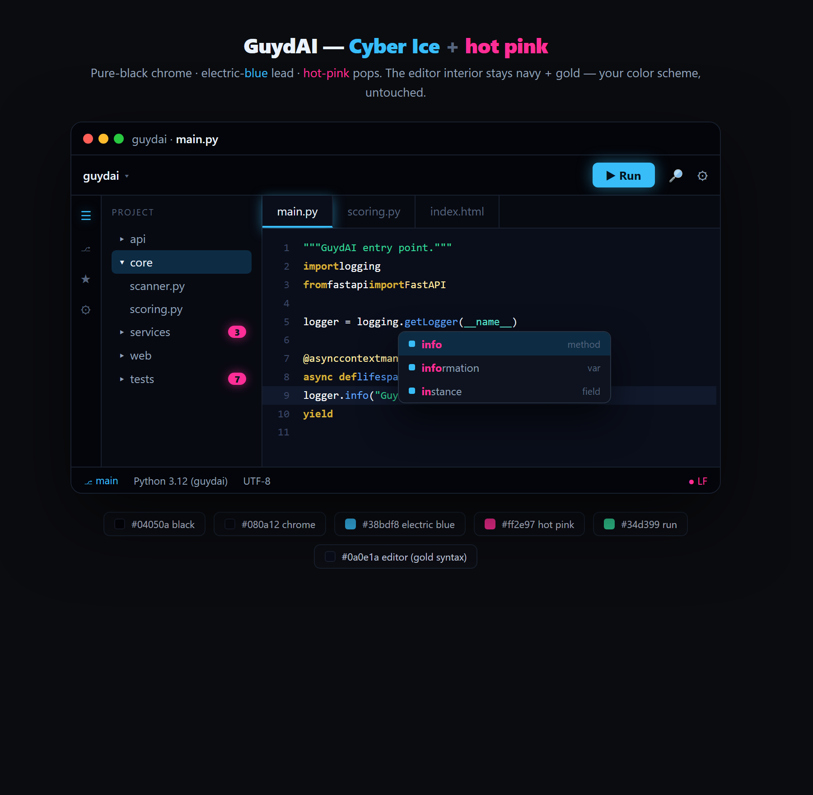

# GuydAI Theme

A dark **PyCharm / IntelliJ theme** with a cyber edge: pure-black chrome, electric-blue
lead accents, and hot-pink pops — wrapped around a navy editor with warm gold syntax.



It ships as two independent layers:

- **IDE chrome — "Cyber Ice"** — pure-black toolbars, tabs, tool windows and popups,
  with electric-blue accents (buttons, active-tab underline, focus, caret) and hot-pink
  pops (badges, completion-match highlight, link hover, bookmarks).
- **Editor color scheme — "GuydAI"** — navy `#0a0e1a` background with gold keywords,
  blue functions, green strings and purple numbers. Usable on its own.

## Palette

**IDE chrome**

| Role | Hex | Used for |
|---|---|---|
| Black | `#04050a` | Title bar, main toolbar, menu bar |
| Chrome | `#080a12` | Tool windows, project tree, tab strip, status bar |
| Card | `#0e131f` | Inputs, popups, menus, completion |
| Border | `#18202e` | Separators, outlines |
| **Electric blue** | `#38bdf8` | **Lead** — buttons, active-tab underline, focus rings, carets, progress, links, checkboxes |
| **Hot pink** | `#ff2e97` | **Pops** — counters/badges, completion match, link hover, bookmarks |
| Green | `#34d399` | Run icon |
| Selection | `#0d2c44` | Selected rows / text |

**Editor syntax**

| Role | Hex | | Role | Hex |
|---|---|---|---|---|
| Background | `#0a0e1a` | | Strings | `#34d399` |
| Keywords | `#D4AF37` | | Numbers / constants | `#a78bfa` |
| Classes / decorators | `#FFE9A3` | | Built-ins | `#5eead4` |
| Functions | `#60a5fa` | | Comments | `#6b7591` |

## Install

Requires a JetBrains IDE on the **New UI** (PyCharm / IntelliJ IDEA / etc., 2024.1+).

**Theme + editor scheme (recommended):**
1. Download [`GuydAI-Theme.jar`](GuydAI-Theme.jar).
2. In your IDE: **Settings → Plugins → ⚙ → Install Plugin from Disk…** → select the `.jar`.
3. Click **Restart IDE** when prompted.
4. **Settings → Appearance & Behavior → Appearance → Theme → "GuydAI"**.

Selecting the theme also applies the matching **GuydAI** editor color scheme.

**Editor colors only (no chrome):**
**Settings → Editor → Color Scheme → ⚙ → Import Scheme…** → select [`GuydAI.icls`](GuydAI.icls).

## Build from source

The plugin is just three files (`src/`) zipped into a `.jar`. To rebuild after edits:

```powershell
./build.ps1
```

> Entry paths inside the JAR must use forward slashes, so `build.ps1` uses the .NET
> zip API directly rather than `Compress-Archive` (which writes backslashes and
> produces a JAR the IDE can't read).

## Repo layout

```
GuydAI-Theme.jar      installable plugin (chrome + editor scheme)
GuydAI.icls           standalone editor color scheme
build.ps1             rebuilds the .jar from src/
src/
  META-INF/plugin.xml plugin manifest
  guydai.theme.json   UI chrome theme
  GuydAI.icls         editor scheme bundled into the jar
preview/              browser mockups + screenshot
```

## License

[MIT](LICENSE) © GuydAI
